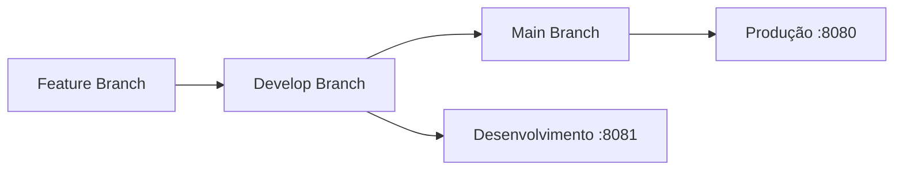

# 🚀 Sistema de Deploy Automático - auth-java-erp

Este projeto está configurado com deploy automático via GitHub Actions para VPS.

**Repositório:** [jeronimo0007/auth-java-erp](https://github.com/jeronimo0007/auth-java-erp)

## 🎯 Fluxo de Deploy



## 📋 PASSO A PASSO COMPLETO

### 🔧 **PASSO 1: Configurar o VPS**

#### 1.1 Conectar ao VPS
```bash
ssh seu-usuario@seu-vps-ip
```

#### 1.2 Executar o script de configuração
```bash
# Baixar e executar o script de configuração
curl -fsSL https://raw.githubusercontent.com/jeronimo0007/auth-java-erp/main/scripts/setup-vps.sh | bash
```

**O que este script faz:**
- Atualiza o sistema
- Instala Docker e Docker Compose
- Configura firewall (portas 22, 8080, 8081)
- Cria diretórios necessários
- Configura Docker para iniciar automaticamente

#### 1.3 Fazer logout e login novamente
```bash
exit
ssh seu-usuario@seu-vps-ip
```

#### 1.4 Verificar se Docker foi instalado
```bash
docker --version
docker-compose --version
```

### 🔑 **PASSO 2: Gerar Chave SSH para GitHub Actions**

#### 2.1 Gerar chave SSH no VPS
```bash
# No VPS
ssh-keygen -t rsa -b 4096 -C "github-actions@seu-vps"
# Pressione Enter para usar o local padrão
# Pressione Enter para não usar senha (ou defina uma se preferir)
```

#### 2.2 Configurar a chave pública
```bash
# Adicionar a chave pública ao authorized_keys
cat ~/.ssh/id_rsa.pub >> ~/.ssh/authorized_keys
chmod 600 ~/.ssh/authorized_keys
```

#### 2.3 Copiar a chave privada
```bash
# Copie este conteúdo - você vai precisar dele no GitHub
cat ~/.ssh/id_rsa
```

### ⚙️ **PASSO 3: Configurar o GitHub**

#### 3.1 Ir para as configurações do repositório
1. Vá para: [https://github.com/jeronimo0007/auth-java-erp/settings/secrets/actions](https://github.com/jeronimo0007/auth-java-erp/settings/secrets/actions)
2. Clique em **New repository secret** para cada variável

#### 3.2 Adicionar os Secrets
| Nome do Secret | Valor | Descrição |
|----------------|-------|-----------|
| `VPS_HOST` | `195.200.1.59` | IP do seu VPS |
| `VPS_USERNAME` | `root` ou `ubuntu` | Usuário do VPS |
| `VPS_SSH_KEY` | Conteúdo do `~/.ssh/id_rsa` | Chave SSH privada (copiada no passo 2.3) |
| `VPS_PORT` | `22` | Porta SSH |
| `DB_URL` | `jdbc:mysql://195.200.1.59:3306/app_omny?useSSL=false&serverTimezone=UTC&allowPublicKeyRetrieval=true` | URL do banco |
| `DB_USERNAME` | `api` | Usuário do banco |
| `DB_PASSWORD` | `c6m8n4d2d3` | Senha do banco |
| `JWT_SECRET` | `mySecretKey123456789012345678901234567890` | Chave JWT |
| `JWT_EXPIRATION` | `86400` | Expiração JWT |
| `STORAGE_S3_NAME_SPACE` | `seu-bucket-name` | Nome do bucket S3 |
| `STORAGE_S3_ACCESS_KEY` | `sua-access-key` | Access Key S3 |
| `STORAGE_S3_SECRET_KEY` | `sua-secret-key` | Secret Key S3 |
| `RABBITMQ_HOST` | `localhost` | Host RabbitMQ |
| `RABBITMQ_USERNAME` | `guest` | Usuário RabbitMQ |
| `RABBITMQ_PASSWORD` | `guest` | Senha RabbitMQ |

### 📝 **PASSO 4: Atualizar os Workflows**

Os arquivos já estão configurados com o repositório correto:
- `.github/workflows/deploy-prod.yml` ✅
- `.github/workflows/deploy-dev.yml` ✅
- `docker-compose.prod.yml` ✅
- `docker-compose.dev.yml` ✅
- `docker-compose.nginx.yml` ✅

**Não é necessário alterar nada!** Os workflows já estão usando `jeronimo0007/auth-java-erp`.

### 🚀 **PASSO 5: Testar o Deploy**

#### 5.1 Fazer commit das alterações
```bash
git add .
git commit -m "feat: configuração de deploy automático"
git push origin main
```

#### 5.2 Verificar o deploy
1. Vá para a aba **Actions** no GitHub: [https://github.com/jeronimo0007/auth-java-erp/actions](https://github.com/jeronimo0007/auth-java-erp/actions)
2. Você deve ver o workflow "Deploy to Production" rodando
3. Aguarde a conclusão (cerca de 5-10 minutos)

#### 5.3 Testar a aplicação
```bash
# No VPS, verificar se o container está rodando
docker ps

# Testar a aplicação
curl http://localhost:8080/actuator/health
```

### 🧪 **PASSO 6: Testar Deploy de Desenvolvimento**

#### 6.1 Criar branch develop (se não existir)
```bash
git checkout -b develop
git push origin develop
```

#### 6.2 Fazer merge para develop
```bash
git checkout develop
git merge main
git push origin develop
```

#### 6.3 Verificar deploy de desenvolvimento
- Vá para **Actions** no GitHub
- Deve aparecer "Deploy to Development"
- Aguarde a conclusão

#### 6.4 Testar aplicação de desenvolvimento
```bash
# No VPS
docker ps  # Deve mostrar auth-prod e auth-dev

# Testar desenvolvimento
curl http://localhost:8081/actuator/health
```

### 🌐 **PASSO 7: Verificar URLs de Acesso**

Após o deploy, suas aplicações estarão disponíveis em:

- **Produção**: `http://SEU-VPS-IP:8080`
- **Desenvolvimento**: `http://SEU-VPS-IP:8081`

## 🚀 Como Deployar no Futuro

### Produção (Porta 8080)
```bash
git checkout main
git merge develop
git push origin main
```

### Desenvolvimento (Porta 8081)
```bash
git checkout develop
git merge feature/nova-funcionalidade
git push origin develop
```

## 🛠️ Comandos Úteis

### Gerenciar Containers
```bash
# Status
./scripts/manage-containers.sh status

# Logs
./scripts/manage-containers.sh logs prod
./scripts/manage-containers.sh logs dev

# Reiniciar
./scripts/manage-containers.sh restart all

# Backup
./scripts/manage-containers.sh backup
```

### Docker Direto
```bash
# Ver containers
docker ps

# Ver logs
docker logs auth-prod
docker logs auth-dev

# Parar containers
docker stop auth-prod auth-dev

# Remover containers
docker rm auth-prod auth-dev
```

## 🔍 Monitoramento

### Health Checks
- Produção: `http://seu-vps:8080/actuator/health`
- Desenvolvimento: `http://seu-vps:8081/actuator/health`

### Logs
```bash
# Logs em tempo real
docker logs -f auth-prod
docker logs -f auth-dev

# Últimas 100 linhas
docker logs --tail=100 auth-prod
```

## 🆘 Troubleshooting

### Container não inicia
1. Verificar logs: `docker logs auth-prod`
2. Verificar variáveis de ambiente
3. Verificar recursos do VPS

### Deploy falha
1. Verificar GitHub Actions logs: [https://github.com/jeronimo0007/auth-java-erp/actions](https://github.com/jeronimo0007/auth-java-erp/actions)
2. Verificar secrets do GitHub
3. Verificar conectividade SSH

### Aplicação não responde
1. Verificar se container está rodando: `docker ps`
2. Verificar portas: `netstat -tlnp | grep :8080`
3. Verificar firewall: `sudo ufw status`

## 📊 Estrutura de Arquivos

```
├── .github/workflows/
│   ├── deploy-prod.yml      # Deploy produção
│   └── deploy-dev.yml       # Deploy desenvolvimento
├── scripts/
│   ├── setup-vps.sh         # Configuração VPS
│   ├── deploy-prod.sh       # Script deploy produção
│   ├── deploy-dev.sh        # Script deploy desenvolvimento
│   └── manage-containers.sh # Gerenciador containers
├── docker-compose.yml       # Desenvolvimento local
├── docker-compose.prod.yml  # Produção
├── docker-compose.dev.yml   # Desenvolvimento
├── docker-compose.nginx.yml # Nginx proxy
├── nginx/nginx.conf         # Configuração Nginx
└── dockerfile               # Imagem Docker
```

## 🔐 Segurança

- ✅ Containers rodam como usuário não-root
- ✅ Health checks configurados
- ✅ Logs rotacionados automaticamente
- ✅ Imagens Docker otimizadas (multi-stage build)
- ✅ Variáveis de ambiente via secrets
- ✅ Credenciais do banco em variáveis de ambiente

## 📈 Próximos Passos

1. **SSL/HTTPS**: Configurar certificados SSL
2. **Monitoramento**: Adicionar Prometheus/Grafana
3. **Backup**: Automatizar backup do banco
4. **Scaling**: Configurar load balancer
5. **CI/CD**: Adicionar testes automatizados

## 🔗 Links Úteis

- **Repositório**: [https://github.com/jeronimo0007/auth-java-erp](https://github.com/jeronimo0007/auth-java-erp)
- **GitHub Actions**: [https://github.com/jeronimo0007/auth-java-erp/actions](https://github.com/jeronimo0007/auth-java-erp/actions)
- **Secrets**: [https://github.com/jeronimo0007/auth-java-erp/settings/secrets/actions](https://github.com/jeronimo0007/auth-java-erp/settings/secrets/actions)

---

**🎉 Sistema configurado e pronto para uso!**

Agora você tem deploy automático configurado:
- **Merge para `main`** → Deploy automático em produção (porta 8080)
- **Merge para `develop`** → Deploy automático em desenvolvimento (porta 8081)
