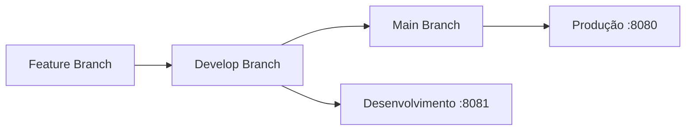

# 🚀 Sistema de Deploy Automático

Este projeto está configurado com deploy automático via GitHub Actions para VPS.

## 🎯 Fluxo de Deploy



## 📋 Configuração Rápida

### 1. Configurar VPS
```bash
# Conectar ao VPS
ssh seu-usuario@seu-vps-ip

# Executar configuração
curl -fsSL https://raw.githubusercontent.com/SEU_USUARIO/SEU_REPOSITORIO/main/scripts/setup-vps.sh | bash
```

### 2. Configurar GitHub Secrets
Vá para: `Settings > Secrets and variables > Actions`

Adicione:
- `VPS_HOST`: IP do VPS
- `VPS_USERNAME`: Usuário do VPS  
- `VPS_SSH_KEY`: Chave SSH privada
- `STORAGE_S3_NAME_SPACE`: Nome do bucket
- `STORAGE_S3_ACCESS_KEY`: Access key
- `STORAGE_S3_SECRET_KEY`: Secret key
- `RABBITMQ_HOST`: Host do RabbitMQ
- `RABBITMQ_USERNAME`: Usuário RabbitMQ
- `RABBITMQ_PASSWORD`: Senha RabbitMQ

### 3. Atualizar Repositório
Edite os arquivos de workflow e docker-compose substituindo `SEU_USUARIO/SEU_REPOSITORIO` pelo nome real.

## 🚀 Como Deployar

### Produção (Porta 8080)
```bash
git checkout main
git merge develop
git push origin main
```

### Desenvolvimento (Porta 8081)
```bash
git checkout develop
git merge feature/nova-funcionalidade
git push origin develop
```

## 🛠️ Comandos Úteis

### Gerenciar Containers
```bash
# Status
./scripts/manage-containers.sh status

# Logs
./scripts/manage-containers.sh logs prod
./scripts/manage-containers.sh logs dev

# Reiniciar
./scripts/manage-containers.sh restart all

# Backup
./scripts/manage-containers.sh backup
```

### Docker Direto
```bash
# Ver containers
docker ps

# Ver logs
docker logs auth-prod
docker logs auth-dev

# Parar containers
docker stop auth-prod auth-dev

# Remover containers
docker rm auth-prod auth-dev
```

## 🔍 Monitoramento

### Health Checks
- Produção: `http://seu-vps:8080/actuator/health`
- Desenvolvimento: `http://seu-vps:8081/actuator/health`

### Logs
```bash
# Logs em tempo real
docker logs -f auth-prod
docker logs -f auth-dev

# Últimas 100 linhas
docker logs --tail=100 auth-prod
```

## 🆘 Troubleshooting

### Container não inicia
1. Verificar logs: `docker logs auth-prod`
2. Verificar variáveis de ambiente
3. Verificar recursos do VPS

### Deploy falha
1. Verificar GitHub Actions logs
2. Verificar secrets do GitHub
3. Verificar conectividade SSH

### Aplicação não responde
1. Verificar se container está rodando: `docker ps`
2. Verificar portas: `netstat -tlnp | grep :8080`
3. Verificar firewall: `sudo ufw status`

## 📊 Estrutura de Arquivos

```
├── .github/workflows/
│   ├── deploy-prod.yml      # Deploy produção
│   └── deploy-dev.yml       # Deploy desenvolvimento
├── scripts/
│   ├── setup-vps.sh         # Configuração VPS
│   ├── deploy-prod.sh       # Script deploy produção
│   ├── deploy-dev.sh        # Script deploy desenvolvimento
│   └── manage-containers.sh # Gerenciador containers
├── docker-compose.yml       # Desenvolvimento local
├── docker-compose.prod.yml  # Produção
├── docker-compose.dev.yml   # Desenvolvimento
├── docker-compose.nginx.yml # Nginx proxy
├── nginx/nginx.conf         # Configuração Nginx
└── dockerfile               # Imagem Docker
```

## 🔐 Segurança

- ✅ Containers rodam como usuário não-root
- ✅ Health checks configurados
- ✅ Logs rotacionados automaticamente
- ✅ Imagens Docker otimizadas (multi-stage build)
- ✅ Variáveis de ambiente via secrets

## 📈 Próximos Passos

1. **SSL/HTTPS**: Configurar certificados SSL
2. **Monitoramento**: Adicionar Prometheus/Grafana
3. **Backup**: Automatizar backup do banco
4. **Scaling**: Configurar load balancer
5. **CI/CD**: Adicionar testes automatizados

---

**🎉 Sistema configurado e pronto para uso!**
